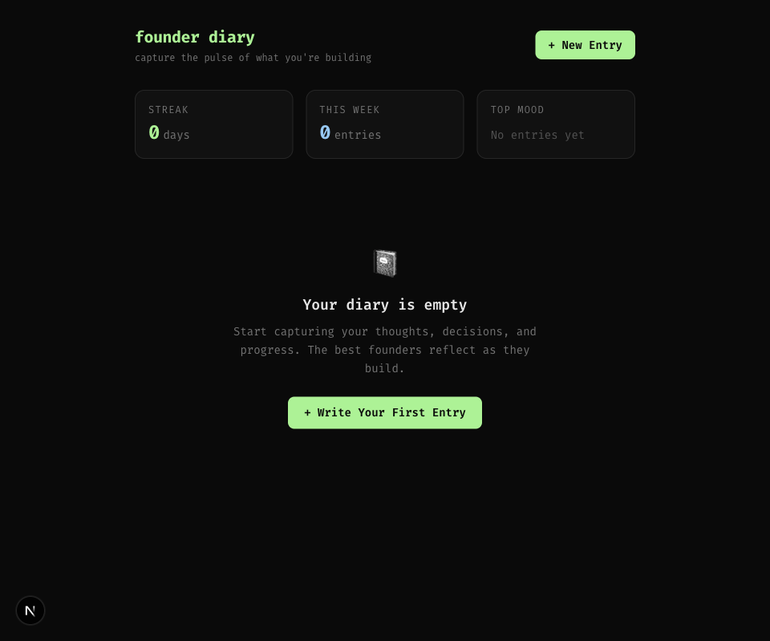
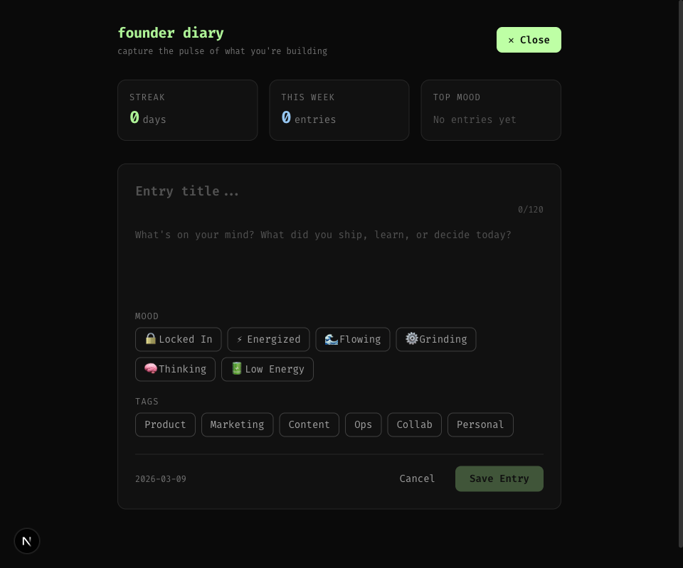
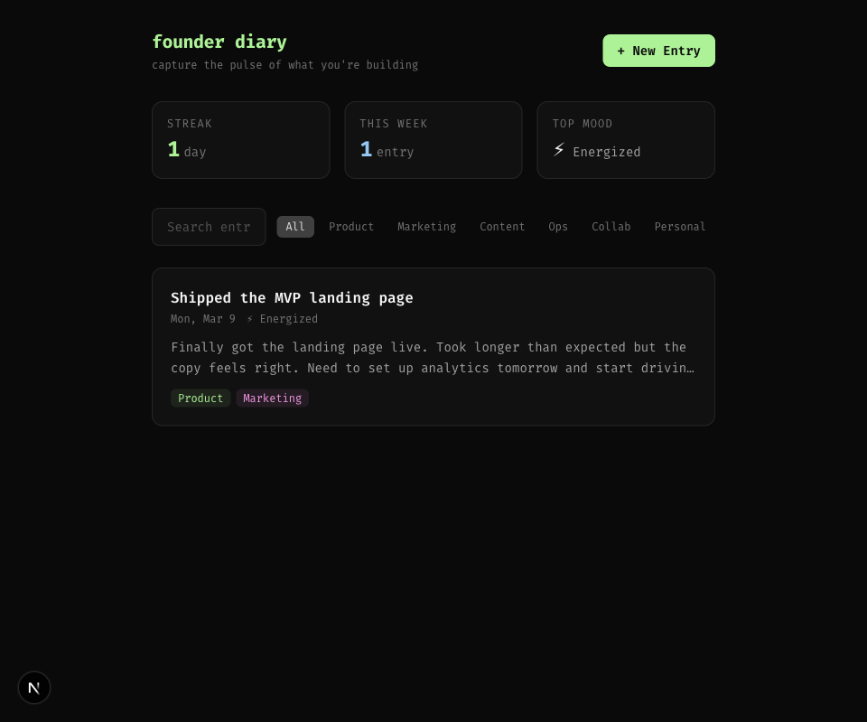
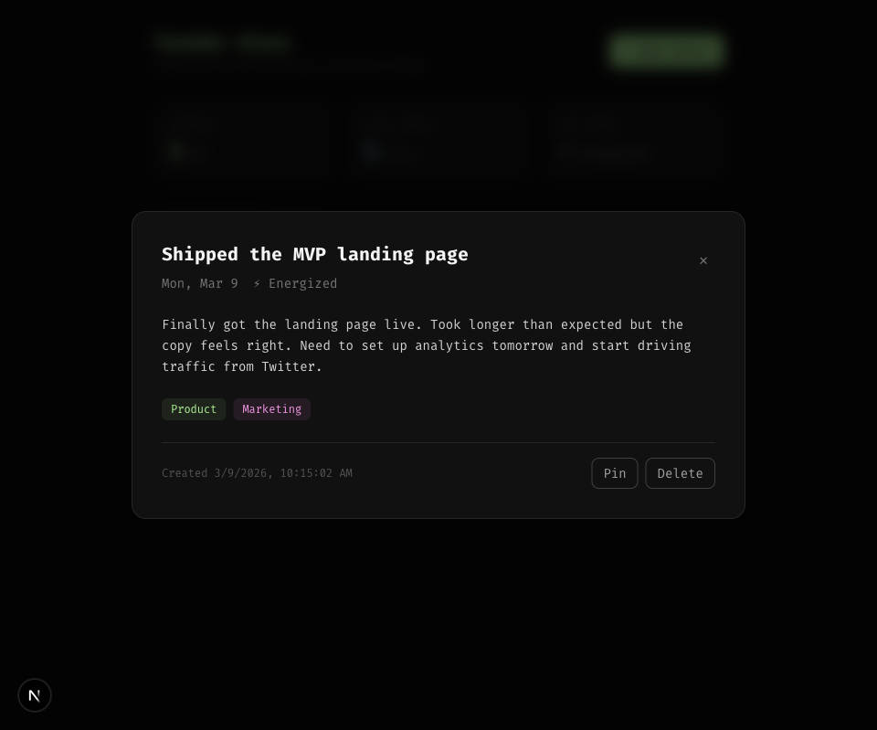

# Founder Diary 📓

A minimal journaling app for founders to capture daily progress, track mood, and reflect on the building journey — stored entirely in your browser.



## Features

- **Daily Entries** — Write titled journal entries with a date, body text, mood, and tags
- **Mood Tracking** — Six founder-focused moods: Locked In 🔒, Energized ⚡, Flowing 🌊, Grinding ⚙️, Thinking 🧠, Low Energy 🔋
- **Tags** — Categorize entries by area: Product, Marketing, Content, Ops, Collab, Personal
- **Pin & Search** — Pin important entries to the top; full-text search and tag filtering
- **Stats Bar** — At-a-glance summary of your entry history
- **Local-first** — No account or backend required; all data lives in your browser via `localStorage`

## Screenshots

| New Entry Form | Entry Saved | Entry Detail |
|----------------|-------------|--------------|
|  |  |  |

## Tech Stack

| Technology | Version |
|---|---|
| [Next.js](https://nextjs.org) | 16 |
| [React](https://react.dev) | 19 |
| [TypeScript](https://www.typescriptlang.org) | 5 |
| [Tailwind CSS](https://tailwindcss.com) | 4 |

## Getting Started

### Prerequisites

- Node.js v18 or later
- A package manager: npm, yarn, pnpm, or bun

### Setup

1. **Clone the repo**

   ```bash
   git clone https://github.com/LadyKerr/founderdiary.git
   cd founderdiary
   ```

2. **Install dependencies**

   ```bash
   npm install
   ```

3. **Run the dev server**

   ```bash
   npm run dev
   ```

4. **Open the app** at [http://localhost:3000](http://localhost:3000)

### Available Scripts

| Command | Description |
|---|---|
| `npm run dev` | Start the development server with hot reload |
| `npm run build` | Create an optimized production build |
| `npm run start` | Serve the production build |
| `npm run lint` | Run ESLint across the project |

## Environment Variables

Founder Diary is entirely local-first — all data is persisted in the browser's `localStorage`. No environment variables are required to run the app.

## Project Structure

```
founderdiary/
├── app/
│   ├── components/     # UI components (Header, EntryCard, EntryForm, …)
│   ├── lib/
│   │   ├── types.ts    # Domain types and constants (Mood, Tag, DiaryEntry)
│   │   ├── storage.ts  # localStorage helpers (read, write, delete, pin)
│   │   └── utils.ts    # Sorting and utility functions
│   ├── globals.css
│   ├── layout.tsx
│   └── page.tsx        # Main app — state management and layout
└── public/
```

## Contributing

All contributions are welcome! Here is a quick guide:

1. Fork the repository and create a branch off `main`:

   ```bash
   git checkout -b feat/your-feature
   ```

2. Make your changes and verify the app works:

   ```bash
   npm run dev
   ```

3. Lint your code before pushing:

   ```bash
   npm run lint
   ```

4. Open a pull request with a clear description of the change.

For larger additions, please open an issue first so the approach can be discussed before implementation.

## License

This project is open source. See the repository for license details.
